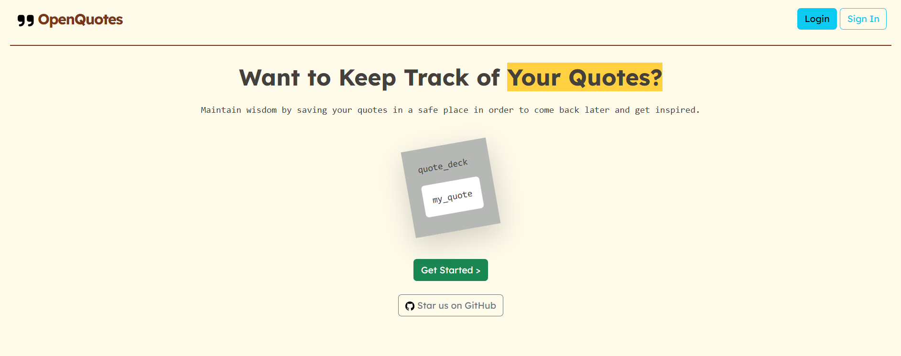

    

<h1 align="center">
    OpenQuotes - A Vault for your Quotes
</h1>

   save your inpiring and favorite quotes in a memorable place

   an epita S2 PHP project

## Overview

OpenQuotes is a web application that allows you to CRUD (Create, Read, Update, and Delete) your quotes. The application includes user authentication: the ability to sign in, log in, and delete user account. 

